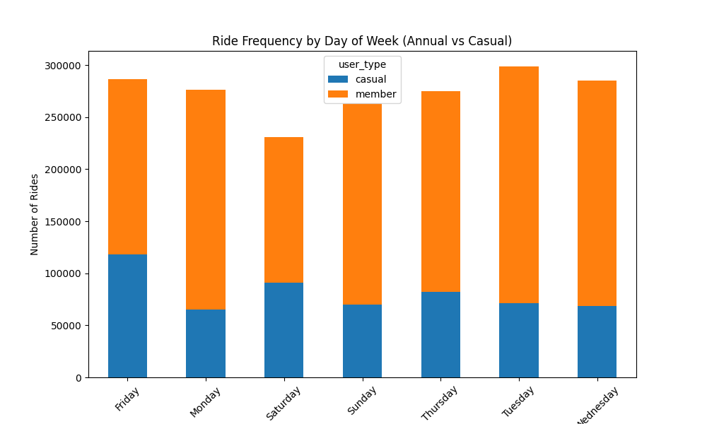
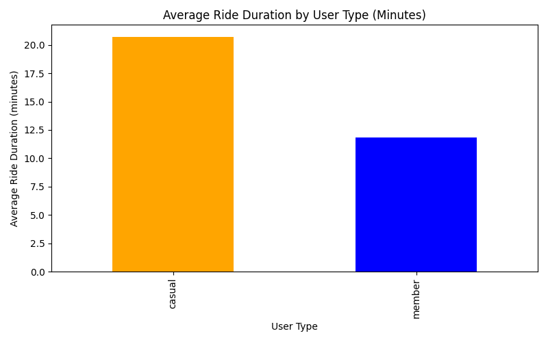
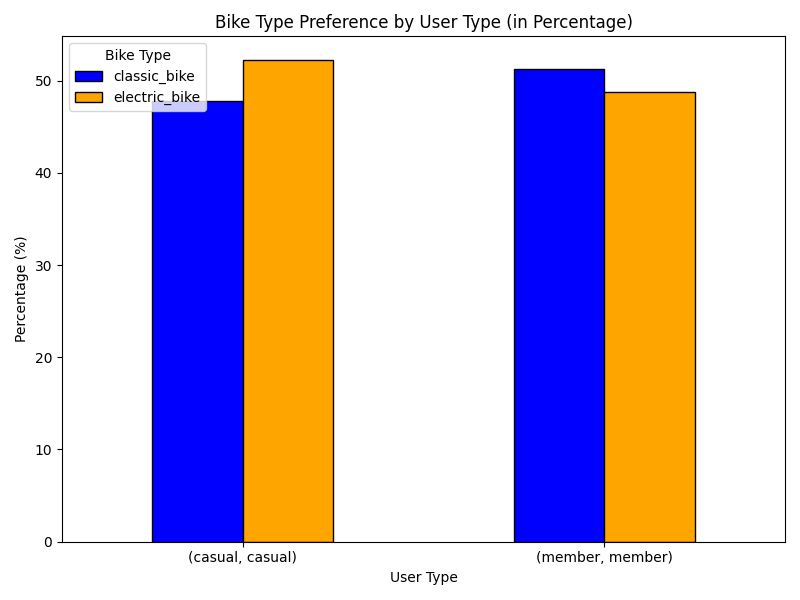

# How Does Cyclistic Navigate Speedy Success?

## Introduction

**Objective**:  
Increase annual memberships by understanding how casual riders and annual members use Cyclistic bikes differently. This insight will help design a more targeted marketing strategy to convert casual riders into long-term members.

---

## Defining the Problem

**Business Task**:  
Cyclistic’s success depends on converting casual riders into annual members. The goal is to identify how their usage patterns differ and use this information to drive marketing efforts.

**Key Questions**:  
- Are there differences in ride frequency, duration, and bike type preferences between casual riders and annual members?
- How can these differences inform a marketing strategy that encourages casual riders to become annual members?

---

## Data Collection & Setup

**Data Overview**:  
- 12 CSV files containing ride data for each month.
- Key attributes include ride timestamps, bike type, and user type (casual or annual).

**Data Preparation**:  
- Data cleaned for inconsistencies and missing values.
- New columns created for ride duration and day of the week for further analysis.

---

## Key Insights

### Ride Frequency by Day of the Week
- **Casual Riders**:  
  Peak on Fridays and weekends, showing increased usage during these periods.  
  
  
- **Annual Members**:  
  Ride consistently throughout the week, with a noticeable dip on Fridays.  
  

### Ride Duration
- **Casual Riders**:  
  Tend to take longer rides compared to annual members.  
  

### Bike Type Preference

- **Casual Riders**:  
  Slightly prefer electric bikes over classic bikes.  
- **Annual Members**:  
  Show a stronger preference for classic bikes.  

---

## Communicating the Findings

- **Casual Riders**:  
  Tend to use bikes more on weekends and have a higher preference for electric bikes.  
- **Annual Members**:  
  Use bikes consistently throughout the week and prefer classic bikes.

These differences are crucial for designing targeted marketing strategies aimed at converting casual riders to annual members.

---

## Top Recommendations

1. **Encourage Longer Rides for Casual Riders**  
   - **Why**: Casual riders tend to take shorter trips.  
   - **Action**: Introduce incentives like discounts on longer rides or highlight scenic routes to encourage extended usage.

2. **Create Weekend Promotions for Casual Riders**  
   - **Why**: Casual riders peak on Fridays and weekends.  
   - **Action**: Launch weekend-specific promotions to increase ridership during these high-demand periods.

3. **Reallocate Bike Fleet Based on Preferences**  
   - **Why**: Casual riders prefer electric bikes, while annual members prefer classic bikes.  
   - **Action**: Reallocate bikes to ensure stations with higher casual rider traffic are stocked with electric bikes to meet demand.

---

## Conclusion & Next Steps

- **Next Steps**:  
  - Execute the recommendations, focusing on increasing ridership during weekends and encouraging longer rides.
  - Reallocate the bike fleet to better align with user preferences.
  - Monitor the impact of these changes on ride duration and membership conversions.
